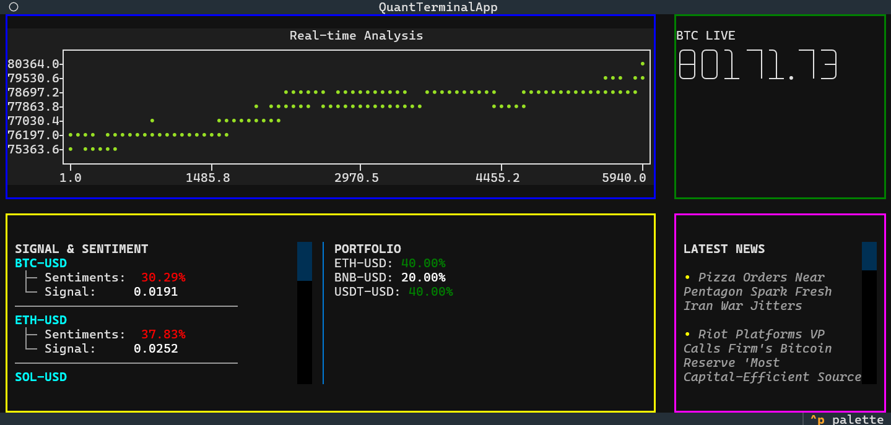

# CryptoTerminal
An automatic trading and crypto analyzer, provided using BERT model for sentiment analysis,and technical analysis, and portofolio optimization algorithm 

## How to get started 
Before we begin install all of the requirenment in requirenment.txt
```bash
pip install -r requirements.txt
```
make sure you have an secret and api key to the desired exchange (Currently only support bitget) place it in the BITGET_API_KEY and BITGET_PRIVATE_KEY in the .env file

```bash
python Dashboard/dashboard.py
```

## To-do list
- [ ] Add An seperate dashboard for memecoin trade
- [ ] Add an more robust sentiment analysis 
- [ ] Add an robust ML and Deeplearning pipeline for more accurate prediction (Market Prediction)